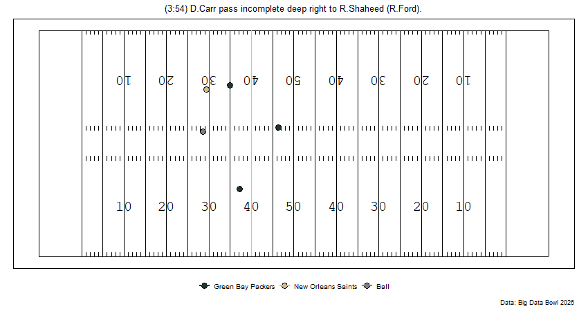
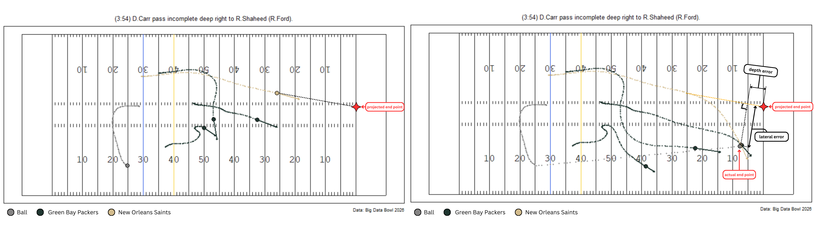
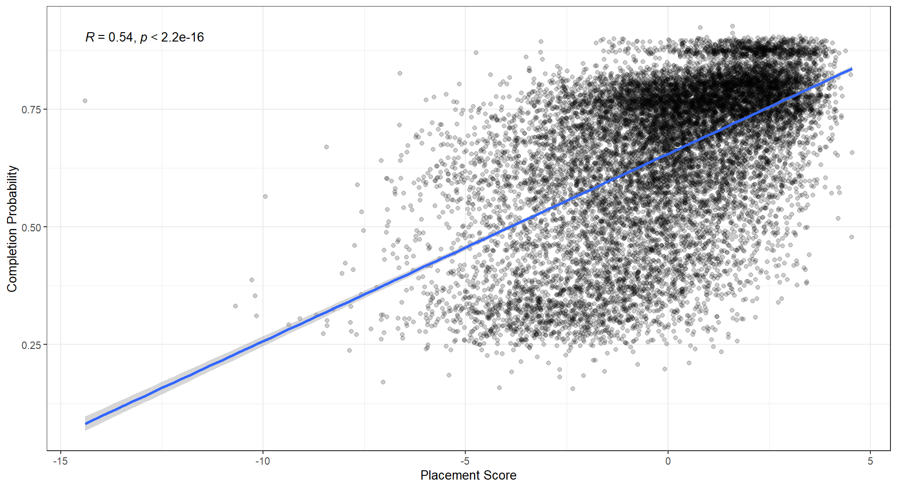
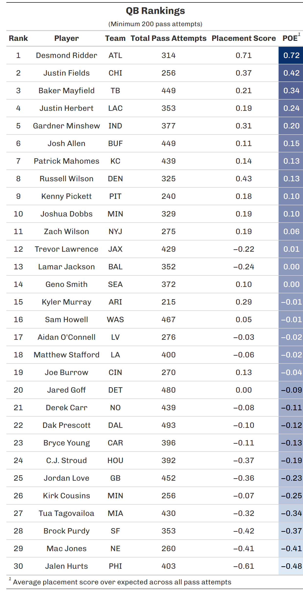
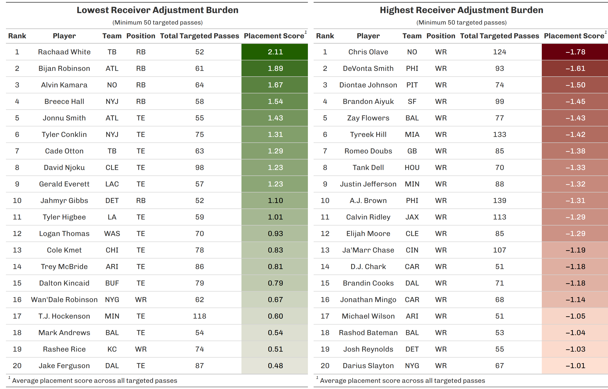
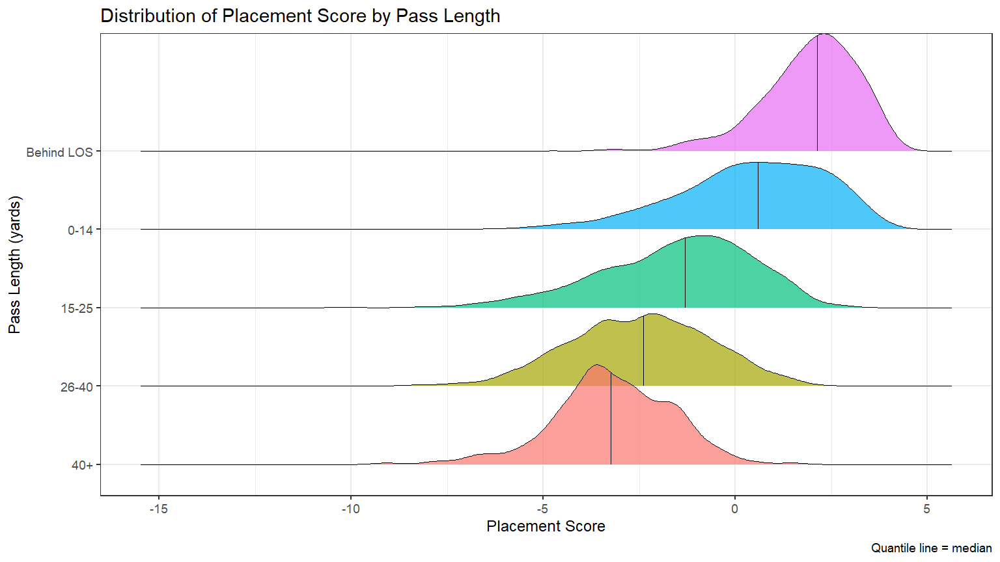

## **Introduction**
The center snaps the ball to the quarterback, who then goes through his read progression before throwing a downfield pass to his intended target receiver. The quarterback must do this in a matter of seconds to avoid getting sacked, and once the ball leaves their hands, the pass result becomes a contest of precision, timing, and movement. The quarterback must read and anticipate their receiver's movement to decide the best placement for the throw, giving their receiver a chance. The 2026 NFL Big Data Bowl has asked participants to help with better understanding these moments by analyzing **player movement while the ball is in the air.**

In this submission, we look at **how a quarterback’s ball placement influences receiver movement.** Rather than evaluating the catch result alone, we focus on what happens between ball release and ball arrival: the adjustments, turns, and acceleration a receiver must make to reach the football. These movements help to understand the quality of the throw and the difficulty imposed on the receiver. **In simpler terms, how does a QB’s throw make the life of a receiver easier or harder?**

To do this, we introduce a **Placement Score**, a metric that measures how much a quarterback's throw deviates from the receiver’s pre-throw trajectory and how much effort the receiver makes in adjusting to the thrown ball. 


## **Motivation**

2023 - New Orleans Saints vs Green Bay Packers (Week 3)

- briefly desciribe what's going on in video.
- almost intercept
- ...
- ...

```{r, eval=knitr::is_html_output(), echo=FALSE}
knitr::include_graphics("../viz/motivating_play2.gif")
```

## **Analysis**
We relied on the provided data of passing plays from the 2023 NFL season. This year's competition was unique in having pre-throw and post-throw data separately, so we combined the two into a one seamless dataset and derived a ‘pseudo ball’ because the frame-by-frame coordinates of the football were not included in the dataset. We also removed five plays we found with issues while creating play animations, leaving us with **14,103 plays.**

The first step in our analysis was to estimate the receiver’s expected arrival location at the moment of the catch. Using the receiver’s pre-throw trajectory, the ball’s landing location, and the time the ball spent in the air, we project where the receiver would have naturally arrived. Then, we compare the receiver’s actual arrival point with their projected arrival point and measure the placement error. The placement error is made up of two components: the **lateral error**, which measures how far the ball was placed left or right of the receiver’s natural path, and the **depth error**, which measures how far the ball ended up too short or too long along the receiver’s natural path. For example, in the play from the motivating example above, we project that R.Shaheed would arrive at the red star in the left static image below (the left image is a snapshot at the throw frame). His actual arrival point is seen in right static image, and we can see how the lateral and depth errors are calculated.

```{r, eval=knitr::is_html_output(), echo=FALSE}

```

```{r, eval=knitr::is_html_output(), echo=FALSE}

```


Next, we quantify the receiver’s adjustment with two features: **total acceleration effort** and **turning rate.** Total acceleration effort is the sum of absolute acceleration values while the ball is in the air. We use the absolute value because we don't care if they sped up or slowed down; acceleration and deceleration both require effort, and we assume that they require the same effort. Turning rate is a measure of the receiver’s average change in direction over the time that the ball was in the air. It is calculated using the formula:
$$
\text{mean}\left(\frac{|\Delta \text{dir}|}{\Delta t}\right)\;(\text{deg/s})
$$


## **Calculating Placement Score**
The **Placement Score**, therefore, combines these four features: lateral error, depth error, total acceleration effort, and turning rate. We standardized each feature and summed them up to get our placement score. We inverted the score so that a higher score means better placement.

$$
\text{Placement Score}
= -\Big(
z(\text{Lateral Error})
+ z(\text{Depth Error})
+ z(\text{Turning Rate})
+ z(\text{Total Acceleration Effort})
\Big)
$$

 
**Higher scores indicate better ball placement:** the quarterback placed the ball where the receiver’s momentum was naturally carrying them, requiring minimal adjustment.

**Lower scores indicate worse ball placement:** the quarterback forced the receiver to make significant adjustments to catch the ball.


## **Results** 
<br>

#### <u>Why is good placement important?</U>

Looking at the relationship between Placement Score and Completion Probability, we see a positive correlation with a coefficient of 0.54, indicating that a higher Placement Score corresponds to higher Completion Probability.

```{r, eval=knitr::is_html_output(), echo=FALSE}

```

<br>

#### <u>Ranking QBs on Placement Score</u>

Not all throws are equal. A 5-yard hitch route in Cover 2 is easier to place than a 40-yard go route against man coverage. Ranking QBs on raw placement scores would penalize those attempting harder throws. To account for this, we control for three contextual factors that affect placement difficulty: 

- Pass length: Longer throws are harder to place accurately
- Route of the targeted receiver: Certain routes are easier to place than others
- Coverage type: man vs zone can affect throwing windows

Using a regression model, we calculate an expected placement score for each throw based on these factors. We then subtract the QB’s expected placement score from their actual placement score to get the Placement Over Expected (POE).

```{r, eval=knitr::is_html_output(), echo=FALSE}

```

<br>

#### <u>Which receivers are forced to work the hardest?</u>
```{r, eval=knitr::is_html_output(), echo=FALSE}

```


## **Discussion**

- conclusion
- use-case
- can be used to divide credit between qb and receiver??
- ...
- ...

#### <u>Limitation</U>

- Projection of receiver’s path does not account for non-linear motion.
- Unable to account for [<u>QB-Receiver chemistry</u>](https://www.tiktok.com/t/ZP8UcCy3B/)
- Does not account for defender proximity.


## **Appendix**

```{r, eval=knitr::is_html_output(), echo=FALSE}

```

